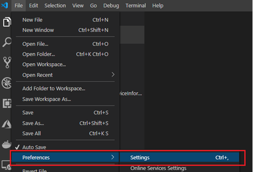

# Getting started with MXChip DevKit on Azure IoT Central Plug and Play

## Prerequisites
- [Visual Studio Code](https://code.visualstudio.com/download)
    - [Arduino Extension](https://marketplace.visualstudio.com/items?itemName=vsciot-vscode.vscode-arduino)
- [Teraterm](https://tera-term.en.lo4d.com/windows) or any other serial client (we need this to configure Wifi on the DevKit)
- Clone the [device firmware code](https://github.com/zhaodong2013062/zhaodong2013062.github.ioMXChip-PnP-Sample).
- Download the [capability model JSON](assets/envsensor.capabilitymodel.json).

## Prepare Your MXChip
1. Ensure that you are in range of a WiFi network.  
   *Note for Microsoft employees: MSFTGUEST will not work, even if you allow the device's MAC address. There is a UTC sync issue that prevents authentication.*

2. Open a serial connection using the serial client of your choice. The device should appear as an STMicroelectronics device. Configure the connection to 115200 baud.  
     
   

3. Plug your MXChip into your computer, hold down the A button, and press the Reset button while the A button is held down. You should see the following screen:  
   

4. use `set_wifissid` and `set_wifipwd` to configure WiFI, then `exit`. Verify that MXChip has connected to wifi:  
   

## IoT Central Setup
1. Go to https://aka.ms/bigmac and create a new Trial application. Be sure to select **Plug and Play** on the **Select an application template** step.  
   

2. Go to **Device Templates** and create a new *Custom* device template with the name "Devkit"

3. At the **Create a Capability Model** step, choose **Import Capability Model** and select the capability model JSON from the [prerequisites](#Prerequisites). You should see the capability model appear with all the appropriate capabilities.   
   

4. From the nav bar on the left, click **Views**, then **Generate Default Views**. The default view panes will be generated, which will allow you to view telemetry and send commands.
   

5. Add another view for **Editing Device and Cloud Data**.  
   

6. Drag the **Brightness Level** and **Customer Name** onto the canvas, then hit **Save**.  
   

7. **Publish** the template using the button on the upper right.  
   

8. Go to **Device Explorer** and create a new device with the name "sampledevkit" under the template you just created. After device creation is completed, click on the device.

9. On the upper right hand corner of the device page, click **Connect** and note the **Scope Id**, **Device ID**, and **Primary Key** of the device. You will need these later.
   

## Environment Setup
1. After you have installed the Arduino Extension, open VSCode Settings.  
   

2. Type "arduino" in the search bar and click "Edit in settings.json".  
   

3. Add `"https://raw.githubusercontent.com/VSChina/azureiotdevkit_tools/pnp/package_azureboard_index.json"` to `"arduino.additionalUrls"`.  
   

4. Open up the command palette by using **Ctrl+Shift+P**, and invoke the **Arduino: Board Manager** command.  

5. In the board manager page, click **Refresh Package Indexes**.   
   

6. After the refresh has completed successfully, type **AZ3166** in the search bar. You should see the MXChip board appear. Select version 1.9.2, then hit **Install**.  
   

# Compile and Upload Code
1. Open the repo folder in Visual Studio Code (you can use the **Ctrl+K, Ctrl+O** keyboard shortcut) and navigate to the `main.ino` file.   

2. Fill your **Scope Id**, **Device ID**, and **Primary Key** from earlier into the appropriate fields near the top of the file.  
   

3. Verify that the Board Type and Serial Port selected on the bottom right of the screen are correct. Your COM port may differ from the image - select the one with the STMicro device.   
   
  - If the board type is incorrect, or there is no board type selected, click on the board type and select MXCHIP AZ3166 in the window that pops up.  
    

3. While `main.ino` is open, press **Ctrl+Alt+U** (or click the **Arduino: Upload** button on the upper right corner of the window). An output window should pop up as the code uploads to your MXChip.  
   

4. Click the **Open Serial Monitor** button on the lower right corner of the window. You should see serial messages coming from your MXChip as it initializes.  
   

# Verify that telemetry and properties are flowing

On the **Overview** pane in your device in IoT Central, you should see temperature and humidity data flowing from the MXChip. You should also be able to execute commands and see the effects on the board. Telemetry, commands, and property updates will also be logged in the serial monitor in VS Code. Here are some things you can try:

- Change the **Customer Name** and your chosen name will display on the MXChip OLED.
- Execute the **Run Diagnostics** command and a fun message will display on the OLED.
- Turn the User LED on and off.
- Change the brightness of the RGB LED (input an integer from 1-255, ignore the tooltip in Central)
- Note: Blink is not working.